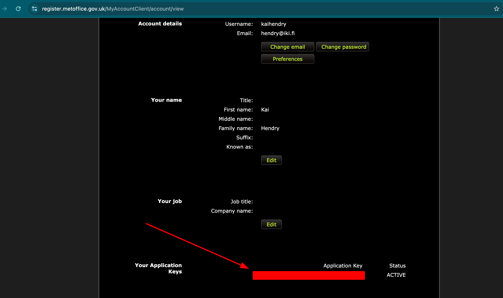

# UK Weather MCP Server

WARNING: [This API will stop working in December 2025](https://www.metoffice.gov.uk/services/data/datapoint/datapoint-retirement-faqs)

    claude mcp add -s project ukweather -e MET_OFFICE_API_KEY=... -- uv run uk_mcp_server.py

# Example

    claude --debug -p "What is the weather in Cardinham?"